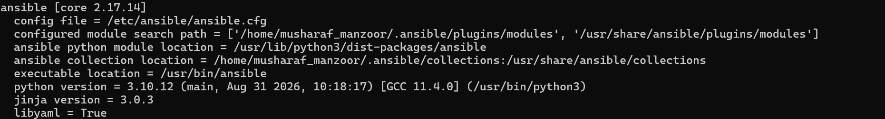

# Ansible Installation 

## Introduction 

Ansible is an automation tool used to configure and manage multiple servers.

In this document, we will learn how to install Ansible on a system.

First log in to your ubuntu account, then run the following commands.

```bash

$ sudo apt update
$ sudo apt install software-properties-common
$ sudo add-apt-repository --yes --update ppa:ansible/ansible
$ sudo apt install ansible

```

## Verify ansbile installation

```bash

$ ansible --version

```

## Installation output





